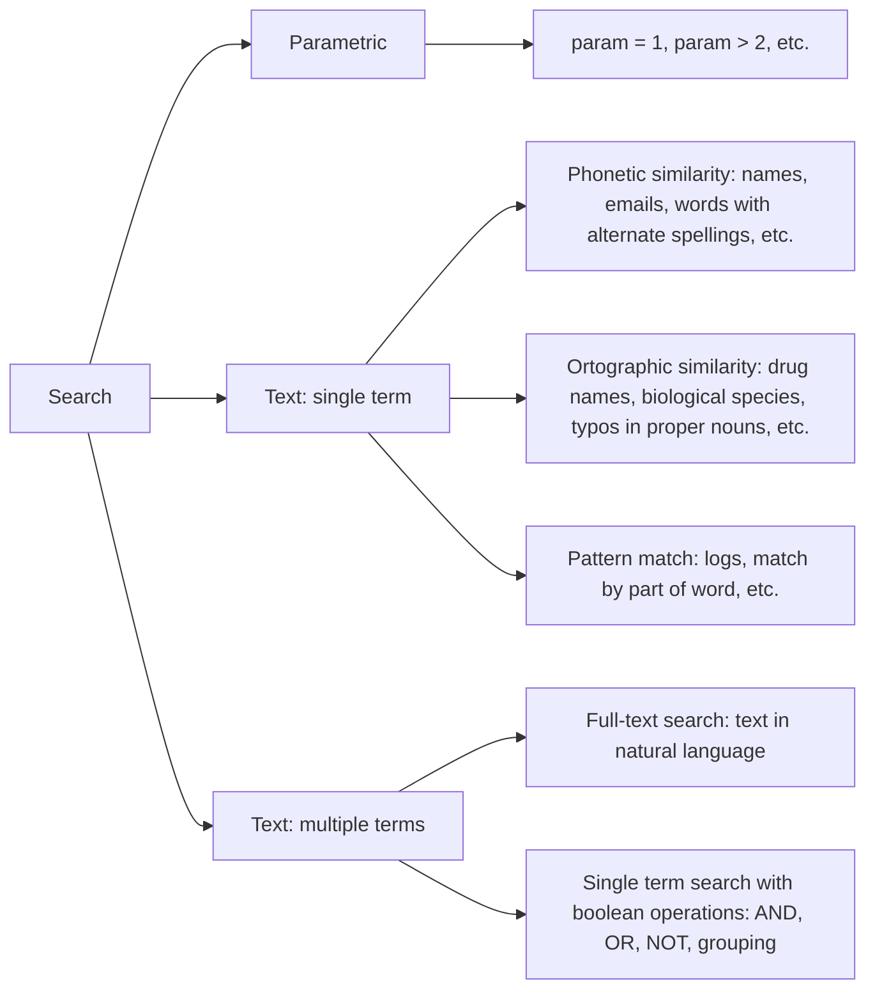

# TODO

- write usage intructions
- check if array works for sort
- publish
- share with ransack

# search_syntax

Parser for "advanced search" query language. Inspired by [GitHub's search syntax](https://docs.github.com/en/search-github/getting-started-with-searching-on-github/understanding-the-search-syntax)

There is no wide accepted terminology for this kind of query language. Sometimes it's called:

- [query string](http://recursion.org/query-parser)
- [search query](https://tgvashworth.com/2016/06/27/twitter-search-query-parser.html)
- [advanced search query](https://github.com/mixmaxhq/search-string)
- [generic query](https://github.com/tomprogers/common-query-parser)

Package provides only parser. AST produced by parser can be converted to a specific "backend", for example:

- [ransack](https://activerecord-hackery.github.io/ransack/getting-started/search-matches/)
- [MySQL Full-Text Search](https://dev.mysql.com/doc/refman/8.0/en/fulltext-boolean.html)
- [PostgreSQL Full-Text Search](https://www.postgresql.org/docs/current/textsearch-controls.html#TEXTSEARCH-PARSING-QUERIES)
- [Meilisearch](https://docs.meilisearch.com/reference/api/search.html#body)
- [Elasticsearch](https://www.elastic.co/guide/en/elasticsearch/reference/current/query-dsl.html)
- [Solr](https://solr.apache.org/guide/6_6/the-standard-query-parser.html)
- [Lucene](https://lucene.apache.org/core/2_9_4/queryparsersyntax.html) ([Lucene vs Solr](https://www.lucenetutorial.com/lucene-vs-solr.html))
- [Sphinx](https://sphinxsearch.com/docs/current/extended-syntax.html)

Transforming AST is out of scope of this package, except for Ransack, which serves as an example of implementation.

## Challenge

Main challenge is to come up with query language intuitive enough that non-techy people can use, but powerfull enough to expose all advanced features.

There are different types of search, they require different features:



**Note**: No. Full-text search is not an universal solution for all types of text search. It is designed to search in natural language texts. But this subject deserves a separate article.

**Parametric search** aka faceted search - [filter by strctured data](https://en.wikipedia.org/wiki/Faceted_search).

**Aproximate search** aka fuzzy search aka approximate string matching - [is the technique of finding strings that match a pattern approximately (rather than exactly)](https://en.wikipedia.org/wiki/Approximate_string_matching).

## Disclaimer

So far parser only supports bare strings, **quoted strings** (`"some string"`) and parameters (`param:1`).

Parser **doesn't** support negation (`not`/`-`), boolean operations (`and`/`&`/`or`/`|`) and groupping (`(a | b)`).

This probably will change as soon as I understand how to add those "advanced" features without making it less user-friendly to non-techy people.

## Installation

Install the gem and add to the application's Gemfile by executing:

    $ bundle add search_syntax

If bundler is not being used to manage dependencies, install the gem by executing:

    $ gem install search_syntax

## Usage

TODO: Write usage instructions here

## Similar packages

- [search_cop](https://github.com/mrkamel/search_cop)
- [easy-filter](https://github.com/Noriller/easy-filter)
- [human-ql](https://github.com/dekellum/human-ql)
- [logical_query_parser](https://github.com/kanety/logical_query_parser)

## Development

After checking out the repo, run `bin/setup` to install dependencies. Then, run `rake test` to run the tests. You can also run `bin/console` for an interactive prompt that will allow you to experiment.

To install this gem onto your local machine, run `bundle exec rake install`. To release a new version, update the version number in `version.rb`, and then run `bundle exec rake release`, which will create a git tag for the version, push git commits and the created tag, and push the `.gem` file to [rubygems.org](https://rubygems.org).

To regenrate parser

```sh
bin/tt lib/search_syntax/search_syntax_grammar.tt
```

## Contributing

Bug reports and pull requests are welcome on GitHub at https://github.com/[USERNAME]/search_syntax. This project is intended to be a safe, welcoming space for collaboration, and contributors are expected to adhere to the [code of conduct](https://github.com/[USERNAME]/search_syntax/blob/master/CODE_OF_CONDUCT.md).

## License

The gem is available as open source under the terms of the [MIT License](https://opensource.org/licenses/MIT).

## Code of Conduct

Everyone interacting in the SearchSyntax project's codebases, issue trackers, chat rooms and mailing lists is expected to follow the [code of conduct](https://github.com/[USERNAME]/search_syntax/blob/master/CODE_OF_CONDUCT.md).
