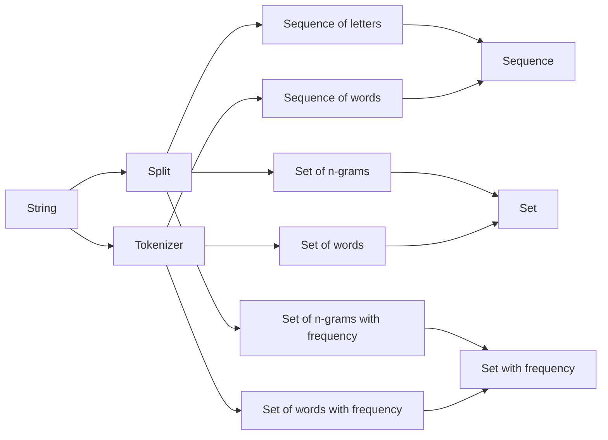

# Approximate string matching algorithms

## Preprocessing

- **Tokenizer** is language dependent, so algorithm would need to know language upfront or be able to detect it.
- **Sequence** is required for "edit distance" algorithms, because they need to know position.
- In means of implementation **set** can be implemented as hash table e.g. `{a: true, b: true}` (`aba`)
  - Than **set with frequency** can be implemented as hash where value would be a frequency `{a: 2, b: 1}` (`aba`)
- There are aslo **skip-grams** which are not shown here

There can be more steps in this process, for example:

- Converting strings to lower case
- Normalizing alphabet, for example `β` can be converted to `ss` or `è` can be converted to `e`
- String can be padded before splitting in n-grams, this will add "weight" to the start or the end of the word.
- Tokenizer can have a lot of dictionary-based operations after splitting, for example:
  - Removing **stop-words** e.g. words which are very common in the language and doesn't add a lot of information, like `the`, `in`, etc.
  - Fixing common spelling errors
  - **Stemming** words e.g. converting them into canonical form, for example `birds` will be converted to `bird`, etc.
  - Replace words with more common synonyms, or convert acronyms to full verstion

## Measures

Measures can be separated in following categories:

1. similarity/dissimilarity
   - similarity - higher value means more closer strings
   - dissimilarity - lower value means more closer strings
     - distance - disimilarity which has metrics properties
2. ranking/relevance
   - if measure returns only `true` and `false` it can be used as relevance, but not as ranking function
   - similarity can be used as ranking if ordered descending
   - dissimilarity can be used as ranking if ordered ascending
3. by type of expected input
   - sequence
   - set
   - set with frequency
4. normalized/not normalized
   - measure is normalised if it's values are in the range 0..1
   - normalised similarity can be converted to dissimilarity using formula `dis(x, y) = 1 - sim(x, y)`
5. By type of assumed error
   - phonetic (if words sound similar). Good for words without but with different spellings, like `Claire`, `Clare`
   - ortographic (if words look similar). Good for detecting typos and errors

| category     | Measure                                     | Input data          | Type                   | Metric        | Normalized                             |
| ------------ | ------------------------------------------- | ------------------- | ---------------------- | ------------- | -------------------------------------- |
| Phonetic     | Phonetic hashing (Soundex, Metaphone, etc.) | sequence of letters | similarity (relevance) |               | Yes                                    |
| Orthographic | Levenshtein distance                        | sequence            | dissimilarity          | Yes           | `l(x, y) / max(len(x), len(y))` , NED  |
|              | Damerau-Levenshtein distance                | sequence            | dissimilarity          |               |                                        |
|              | Hamming distance                            | sequence            | dissimilarity          | Yes           |                                        |
|              | Jaro distance                               | sequence            | dissimilarity          |               |                                        |
|              | Jaro–Winkler distance                       | sequence            | dissimilarity          |               |                                        |
|              | Longest common subsequence (LCS)            | sequence            | similarity             | ?             | `len(lcs(x, y)) / max(len(x), len(y))` |
|              | Jaccard index                               | set                 | similarity             | `1 - j(x ,y)` | Yes                                    |
|              | Dice coefficient                            | set                 | similarity             | ?             | Yes                                    |
|              | Cosine similarity                           | set with frequency  | similarity             | ?             | Yes                                    |

**TODO**: it is not full list of measures

## Algorithms

1. Some measures can have more than one algorithm to calculate it
2. Algorithms are different by computational and space complexity

| Measure                          | Algorithm      | Computational complexity | Space complexity | Comment                                                                                                                                              |
| -------------------------------- | -------------- | ------------------------ | ---------------- | ---------------------------------------------------------------------------------------------------------------------------------------------------- |
| Levenshtein distance             | Wagner-Fischer | O(mn)                    | O(mn)            | Wagner, Robert A., and Michael J. Fischer. "The string-to-string correction problem." Journal of the ACM 21.1 (1974): 168-173                        |
|                                  | Myers          |                          |                  | Myers, Gene. "A fast bit-vector algorithm for approximate string matching based on dynamic programming." Journal of ACM (JACM) 46.3 (1999): 395-415. |
| Longest common subsequence (LCS) | Larsen         | O(log(m)log(n))          | O(mn²)           | "Length of Maximal Common Subsequences", K.S. Larsen                                                                                                 |
|                                  | Hunt–Szymanski |                          |                  | https://imada.sdu.dk/~rolf/Edu/DM823/E16/HuntSzymanski.pdf                                                                                           |

**TODO**: it is not full list of algorithms

## Indexes

All algorithms above assume two input strings. So if we need to search throug a database we would need to go row by by row comparing each value in DB to the query, choose all relevant rows and sort by rank.

This would be slow, so in order to overcome this we can preprocess data and produce data structure more suitable for the given algorithm, to speed up process of retrieval, by making inserts and updates a bit slower. This data structure in the context of database called **index**.

For example we can implement following indexes:

| Algorithm         | Index                                     | Example                              |
| ----------------- | ----------------------------------------- | ------------------------------------ |
| Phonetic hashing  | B-tree with hashed values                 |                                      |
| set of n-grams    | inverted index with trigrams              | PostgreSQL trigram index             |
| sequence of words | inverted index with words (and positions) | PostgreSQL and MySQL full-text index |

- Those indexes won't help much with edit distance algorithm(s), because it is still quite expensive algorithm
  - There is so called BK-tree index, which works in this case but it is not suitable for databases, it is more suitable for fixed dictionary, like correction for spell errors

## Ranking

Theoretically it is possible to use measures as ranking, but the problem is that those functions only take into account two strings. This won't work good for big texts in DB and small queries. Because all measures will be indistinguishable (either very small, or very big).

For this case there are better rnaking functions, such as:

- TF-IDF
- BM25
- DFR similarity
- IB similarity
- LM Dirichlet similarity
- LM Jelinek Mercer similarity
- etc.
