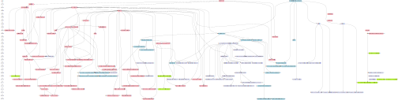

# Exact String Matching

## Reading

- [Exact Online String Matching Bibliography](https://arxiv.org/pdf/1605.05067.pdf)
- [Exact string matching algorithms](https://www-igm.univ-mlv.fr/~lecroq/string/)
- [The String Matching Algorithms Research Tool](https://www.dmi.unict.it/faro/papers/conference/faro47.pdf)

Gonzalo Navarro & Mathieu Raffinot, 2002, Dependency on the size of the alphabet and length of strings:

## Algorithms

1. Type
   - Exact
     - Substring
     - Paatern
   - Approximate
2. Algorithms are different by computational and space complexity
3. Online/Offline
   - Online algorithms search without pre-processing the target data, and need to traverse all data during the search
   - Offline algorithms pre-process the target data and may store it in memory or on disk to speed up query processing (see "Indexes" section below)
4. Exhaustive/Heuristic
   - Exhaustive algorithms guarantee to find all occurrences of the query in the target
   - Heuristic algorithms may not find all similar data. In heuristics, a reduction of the search time is achieved by evaluating only the statistically interesting patterns
5. Global/Local measure of similarity
   - Global takes into account the similarity of all target data to the query
   - Local takes into account the similarity between some part of the target and the query
6. For approximate matching
   - Type of measure (edit distance/similarity)
   - Ranking function
   - Recall and precision
7. Based on
   - characters comparison
   - automata
   - bit-parallelism
8. Depends on size of
   - alphabet
   - text
   - query
9. Relationship to other algorithms
   - Combination of 
   - Modification of / Refinement of / Variant of / Improvement of / Simplification of
10. Year

**Side note**: complexity comparison
- https://www.bigocheatsheet.com/
- https://www.wolframalpha.com/widgets/view.jsp?id=f1988323c9b98e870845564a17bfdf78
- https://www.sciencedirect.com/science/article/pii/S0022000074800085

