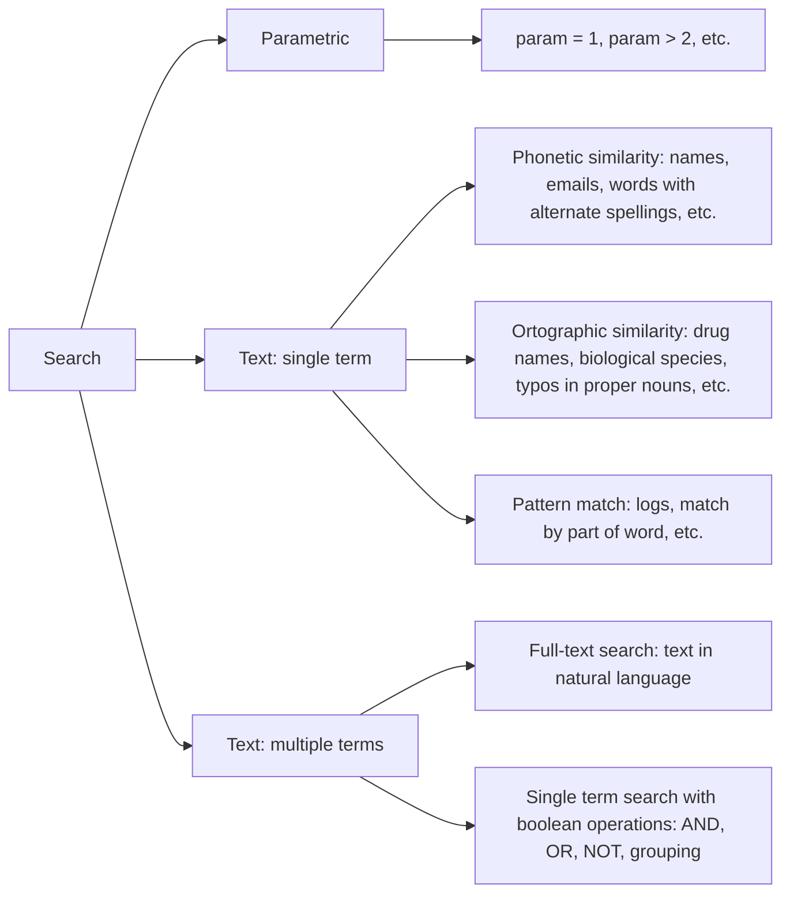

# Language design

Ideas and things to take into account when desigining query language

## Challenge

Main challenge is to come up with query language intuitive enough that non-techy people can use, but powerfull enough to expose all advanced features.

There are different types of search, they require different features:

**Note**: No. Full-text search is not an universal solution for all types of text search. It is designed to search in natural language texts. But this subject deserves a separate article.

## Rich syntax vs intuitivity

Implementing language (parser) is trivial. The problem is that the more advanced language (the more capabilities it has), the less intuitive it is.

It is less intuitive, because you need to deal with:

- precedence (which one have priority: OR, AND?)
- syntax errors, like missing closing bracket
- the need to escape special chars
- that people may be not aware of special meaning of operator
  - for example, it is hard to find CSS properties in Google which start with "-" because minus interpreted as "NOT". So you need to quote those in order to find for them

which may be counterintuitve without syntax checker.

## Operators

**Important**: this is not comparison of features, but rather comparison of syntax.

|                                  | Meilisearch               | Solr      | Sphinx      | MySQL FT boolean | PostgreSQL FT | GitHub syntax           | SQL                 | Google    |
| -------------------------------- | ------------------------- | --------- | ----------- | ---------------- | ------------- | ----------------------- | ------------------- | --------- |
| **Boolean operators** applies to | parametric                | both      | text        | text             | text          | both                    | parametric          | both?     |
| default operator                 |                           | OR        | AND         | OR               |               | AND                     |                     | and?      |
| not                              | NOT                       | NOT / !   | - / !       | - (kind of)      | ! / NOT / -   | NOT / -                 | NOT                 | -         |
| and                              | AND                       | AND / &&  | no operator | + (kind of)      | & / AND       | no operator             | AND                 | and?      |
| or                               | OR                        | OR / \|\| | \|          | no operator      | \| / OR       |                         | OR                  | \| / or   |
| grouping                         | ()                        | ()        | ()          | ()               | ()            |                         | ()                  | ()        |
| **Text search**                  |                           |           |             |                  |               |                         |                     |           |
| phrase search                    | ""                        | ""        | ""          | ""               | <-> / ""      | ""                      | LIKE "%phrase%"     | ""        |
| proximity phrase search          |                           | ""~N      | ""~N        | ""@N             | < N >         |                         |                     | AROUND(N) |
| priority modifier                |                           | ^N, ^=    | ^N          | > / < / ~        | :N            |                         |                     |           |
| prefix search                    |                           | \*, ?     |             | \*               | :\*           |                         | %, \_               | \*, \_    |
| required                         |                           | +         |             | +                |               |                         |                     | +         |
| prohibited                       |                           | -         |             | -                |               |                         |                     | -         |
| **Parametric search**            |                           |           |             |                  |               |                         |                     |           |
| parameter specifier              | param (in separate query) | param:    | @param      |                  |               | param:                  | param               | param:    |
| comparison                       | >, >=, <, <=, =, !=       | implied = | implied =   |                  |               | >, >=, <, <=, implied = | >, >=, <, <=, =, != |           |
| range                            | n TO n                    | [n TO n]  |             |                  |               | n..n                    | <= AND =>           | n..n      |
| other                            | IN [], EXISTS             |           |             |                  |               |                         | IN [], NOT NULL...  |           |

- [ransack](https://activerecord-hackery.github.io/ransack/getting-started/search-matches/)
- [MySQL Full-Text Search](https://dev.mysql.com/doc/refman/8.0/en/fulltext-boolean.html)
- [PostgreSQL Full-Text Search](https://www.postgresql.org/docs/current/textsearch-controls.html#TEXTSEARCH-PARSING-QUERIES)\
- [Meilisearch](https://docs.meilisearch.com/learn/advanced/filtering_and_faceted_search.html#using-filters)
- [Elasticsearch](https://www.elastic.co/guide/en/elasticsearch/reference/current/query-dsl.html)
- [Solr](https://solr.apache.org/guide/6_6/the-standard-query-parser.html)
  - [Lucene](https://lucene.apache.org/core/2_9_4/queryparsersyntax.html) ([Lucene vs Solr](https://www.lucenetutorial.com/lucene-vs-solr.html))
- [Sphinx](https://sphinxsearch.com/docs/current/extended-syntax.html)

## Text + parametric search

- Two separate fields - one for text and one for parametric search
  - separate field for parametric query would allow to do autocomplete for parameters
- One field
  - differentiate params with specific marker like `:` or `@`
    - having marker in prefix position would allow to do autocomplete for parameters
  - differentiate by predefined list of keywords
  - differentiate by one specific marker, for example `text query (params query)`
    - this would allow to do autocomplete for parameters and have boolean operations only for parametric search
- One field with "mode" e.g. ability to switch from text search to text + parametric search
- One field with projectional editing
  - this would allow to do autocomplete for parameters
  - this would allow to prevent syntax errors and show semantic errors (like unknown param)
  - for text we can use "free" editing and for params we can use projectional editing which can be triggered by specific key, but will not get into input
  - https://react-mentions.vercel.app/
  - https://www.npmjs.com/package/react-tag-input
  - this would require [CST](https://www.cse.chalmers.se/edu/year/2011/course/TIN321/lectures/proglang-02.html) rather than AST
- Return parsed query
  - If query is parsed incorrectly it most likely will return no results. And on this screen we can show "parsed" query. For this we need "printer" which will convert CST to HTML 

## No one-size-fits-all

Initial idea was to implement universal language. But more I think of this task more I realized there is no one-size-fits-all solution. So instead I can design language with all possible feature with ability to turn them on and off

| feature              | input        | output                                        | enabled |
| -------------------- | ------------ | --------------------------------------------- | ------- |
| parametric search    | param:1      | param = 1                                     | always  |
|                      | param:>1     | param > 1                                     | ?       |
|                      | param:">1"   | param = ">1"                                  | always  |
| phrase quotation     | "a b"        | containing "a b"                              | always  |
| escape quote         | "\""         | containing "\""                               | always  |
| negation             | -param:1     | NOT (param = 1)                               |         |
|                      | param:!=1    | param != 1                                    | ?       |
|                      | -a           | not containing a                              |         |
|                      | - a          | shall we support space between minus?         |         |
|                      | -"a b"       | not containing "a b"                          |         |
|                      | not a        | not containing a                              |         |
|                      | not "a b"    | not containing "a b"                          |         |
|                      | not"a b"     | shall we support absence of space?            |         |
|                      | not param:1  | not (param = 1)                               |         |
|                      | not -a       | Error?                                        |         |
| grouping             | (a b)        | doesn't make sense without boolean operations |         |
| or                   |              | I will assume that default operator is "and"  |         |
|                      | a\|b         | containing a or b                             |         |
|                      | a \| b       | containing a or b                             |         |
|                      | a\|"b c"     | containing a or "b c"                         |         |
|                      | a or"b c"    | shall we support absence of space?            |         |
|                      | a\|b c       | containing (a or b) and c                     |         |
|                      | (a\|b)       | containing a or b                             |         |
|                      | (a\|b) c     | containing (a or b) and c                     |         |
|                      | a or b       | containing a or b                             |         |
|                      | -(a\|b)      | not containing (a or b)                       |         |
|                      | -a\|b        | not containing a or containing b              |         |
|                      | not a\|b     | not containing a or containing b              |         |
|                      | not (a or b) | not containing (a or b)                       |         |
|                      | not(a or b)  | shall we support absence of space?            |         |
|                      | a:1 \| b:1   | a = 1 or b = 1                                |         |
|                      | a:1 or b:1   | a = 1 or b = 1                                |         |
|                      | a:1\|2       | a = 1 or a = 2. a IN [1, 2]                   |         |
|                      | a:(1 \| 2)   | a = 1 or a = 2. a IN [1, 2]                   |         |
| and                  |              | I will assume that default operator is "and"  |         |
|                      | a b          | containing a and b                            | always  |
|                      | (a b)        | containing a and b                            |         |
|                      | a:1 b:1      | a = 1 and b = 1                               |         |
|                      | a and b      | containing a and b                            |         |
|                      | a:1 and b:1  | a = 1 and b = 1                               |         |
| escape special chars | \\\|         | containing "\"                                | never   |
|                      | "\|"         | containing "\"                                | always  |

## Operator Precedence

- [Microsoft Transact-SQL operator precedence](https://learn.microsoft.com/en-us/sql/t-sql/language-elements/operator-precedence-transact-sql?view=sql-server-2017)
- [Oracle MySQL 9 operator precedence](https://dev.mysql.com/doc/refman/8.0/en/operator-precedence.html)
- [Oracle 10g condition precedence](https://docs.oracle.com/cd/B19306_01/server.102/b14200/conditions001.htm#i1034834)
- [PostgreSQL operator Precedence](https://www.postgresql.org/docs/current/sql-syntax-lexical.html#SQL-PRECEDENCE)
- [SQL as understood by SQLite](https://www.sqlite.org/lang_expr.html)

If we assume that "AND" is the default boolean operator, than it should be lowest.

Option 1:

| Operator      | Associativity | Position |
| ------------- | ------------- | -------- |
| NOT / -       | right         | prefix   |
| OR / \|       | left          | infix    |
| AND / (space) | left          | infix    |

Option 2:

| Operator | Associativity | Position |
| -------- | ------------- | -------- |
| NOT / -  | right         | prefix   |
| AND      | left          | infix    |
| OR / \|  | left          | infix    |
| (space)  | left          | infix    |

## Strange cases

- `"a b`
  - containing `"a` and `b`
  - containing `a b` e.g. as `"a b"`
- `(a b`
  - containing `(a` and `b`
  - containing `a` and `b` e.g. as `(a b)`
- `not -a`
  - containing `a`
  - not containing `-a`
- `not not not`
  - empty query
  - containing `not`
- `|||`
  - empty query
  - containing `|||`
- `""`
  - empty query
- `param:<>1`
  - `param = "<>1"`
- `param: 1`
  - containing `param:` and `1`
  - `param = 1`
- `()`
  - containing `()`
  - empty query
- `--a`
  - containing `a`
  - not containing `-a`
  - containing `--a`
- `a -`
  - containing `a`
  - containing `a` and `-`
- `or a`
  - containing `a`
  - containing `or` and `a`
